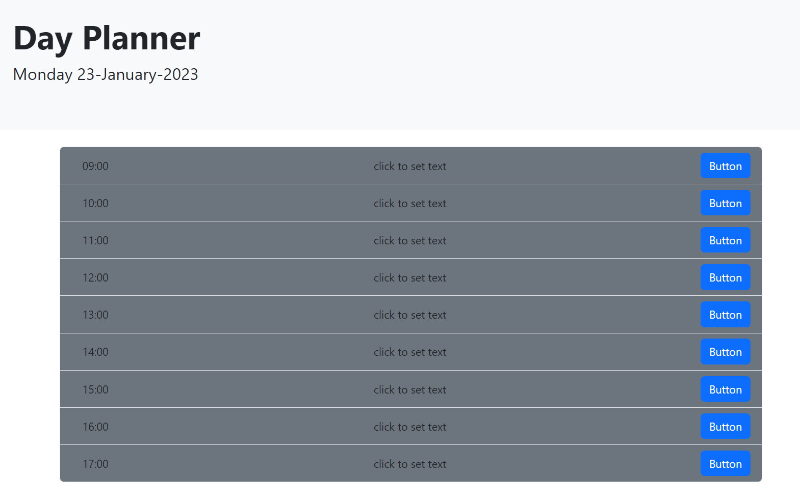

# Day Planner - Bootcamp challenge #7.

##  Day Planner

* Display the current day at the top of the calender when a user opens the planner.
 
* Present timeblocks for standard business hours when the user scrolls down.
 
* Color-code each timeblock based on past, present, and future when the timeblock is viewed.
 
* Allow a user to enter an event when they click a timeblock

* Save the event in local storage when the save button is clicked in that timeblock.

## Deployment

### [repo](https://github.com/S-R-i-c-e/day-planner)
### [webpage](https://s-r-i-c-e.github.io/day-planner/)
javascript code, html rendering, CSS styling. 

## Installation
requires a web-browser - open index.html file.

## Screenshot

## Written by
Stephen Rice 23/01/2023

